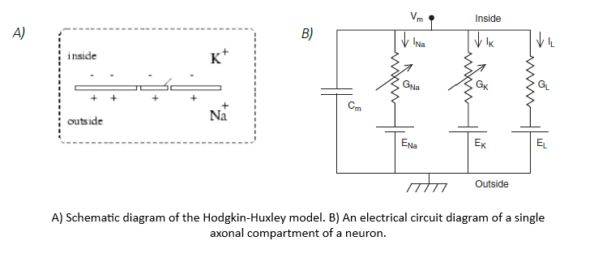
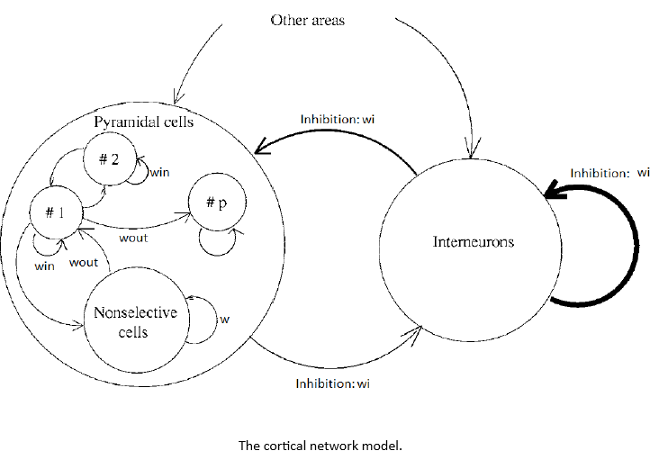

# 🦠 Spiking Neural Models + Working Memmory Experiment 🧠

## About this project

Computational modeling plays a critical role in neuroscience, allowing researchers to test theoretical predictions, manipulate simulation parameters beyond real-world limitations, and explore empirical data in new ways. Neurons, the fundamental units of the nervous system, can be modeled using various approaches, each offering different insights into their behavior.

This repository contains the Matlab code needed to run simulations of neurons focusing on the simplified Izhikevich neuron model. The project addresses two key questions:

1. **Can the Izhikevich model simulate the diverse spiking patterns observed in typical cortical neurons?**

    - The Izhikevich model is a point neuron model or Integrate-and-fire (IAF) neural model mathematically derived from the Hodgkin-Huxley model. It is known for its simplicity and computational efficiency, yet it retains biological realism. We aim to demonstrate its ability to reproduce different neuron spiking behaviors, such as regular spiking, bursting, and fast spiking.
    

2. **When presented with a set of visual stimuli, is a monkey able to identify which image has been shown previously?**

    - To further explore neural networks, we simulate a cortical network to model a short-term memory experiment. This simulation is based on a typical task where a monkey is presented with multiple images and is asked to identify previously seen images, allowing us to investigate how the network responds to such memory tasks.
    

## Files

- Full article and discussion: 📄 [`Spiking neural models Final.pdf`](./Spiking%20neural%20models%20Final.pdf)
- Simulation of the activity of a Izhikevich ´s neuron: `Izhikevich_model.m`
- Working memory experiment: `Izhikevich_cortex_network.m`
